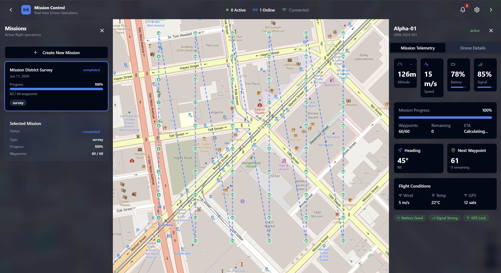

# Drone Mission Management Platform

A real-time drone survey mission management system. Plan survey missions over a map, generate flight waypoints automatically, and watch a physics-based drone simulation fly the mission live over WebSockets.

**Stack:** FastAPI + Python (backend) · React + TypeScript + Vite (frontend) · Leaflet/OpenStreetMap (no API keys required)




## Features

- **Mission planning** — draw a survey area on the map, configure altitude, speed, overlap, and flight pattern
- **Waypoint generation engine** — grid (lawnmower), crosshatch, and perimeter patterns computed from a GeoJSON polygon, with camera-footprint and photo-overlap math (`POST /api/v1/missions/generate-waypoints`)
- **Physics-based flight simulation** — acceleration/deceleration, heading, battery drain, waypoint tracking at a 60 Hz tick rate
- **Live telemetry over WebSockets** — drone position, progress, and battery stream to the dashboard at 1 Hz; the map renders the planned path, numbered waypoints, and a live drone marker
- **Full mission lifecycle** — create → start → pause/resume → complete/abort, with mission records kept in sync with the simulation
- **Fleet management** — register drones and track their status

## Architecture

```
frontend (React + Vite, :5173)
  ├─ Zustand stores (missions, drones, app)
  ├─ REST client  ──────────────►  /api/v1/*           (Vite dev proxy → :8000)
  └─ useSimulationTelemetry  ───►  /api/v1/ws/simulations/{mission_id}

backend (FastAPI, :8000)
  ├─ api/v1          REST routers (missions, drones, simulations, health)
  ├─ services        business logic (MissionService)
  ├─ repositories    in-memory persistence (swappable for a database)
  ├─ simulation      MissionSimulator + SimulationManager (async engine)
  ├─ websocket       per-mission + global telemetry streams
  └─ utils           waypoint generation (shapely geometry)
```

Storage is in-memory by design — the platform runs with zero external dependencies (no database, no Docker, no API keys). The repository layer isolates persistence so a database can be added without touching the API or services.

## Getting started

### Prerequisites

- Python 3.11+
- Node.js 18+

### Backend

```bash
cd backend
python -m venv venv
venv\Scripts\activate          # Windows
# source venv/bin/activate     # macOS/Linux
pip install -r requirements.txt
uvicorn main:app --reload
```

API docs are served at <http://localhost:8000/docs>.

### Frontend

```bash
cd frontend
npm install
npm run dev
```

Open <http://localhost:5173>. The dev server proxies `/api` to the backend.

### Try it

1. Click **Create New Mission**, draw a survey area, and save — or seed one from the command line:

```bash
# Generate waypoints for a polygon
curl -X POST http://localhost:8000/api/v1/missions/generate-waypoints \
  -H "Content-Type: application/json" \
  -d '{"polygon":{"type":"Polygon","coordinates":[[[-122.4194,37.7749],[-122.4154,37.7749],[-122.4154,37.7779],[-122.4194,37.7779],[-122.4194,37.7749]]]},"altitude":100,"pattern":"grid","overlap_percent":60}'
```

2. Select the mission in the left panel and press **Start**.
3. Watch the drone fly the route live — progress, battery, and waypoint completion update in real time.

## Testing

```bash
cd backend
pip install -r requirements-dev.txt
pytest
```

The suite covers mission CRUD, the full simulation lifecycle (including WebSocket initial state), waypoint generation geometry, and the drone fleet API.

Frontend checks:

```bash
cd frontend
npm run lint
npm run build   # type-checks with tsc, then bundles
```

## API overview

| Method | Endpoint | Description |
|---|---|---|
| `GET` | `/api/v1/health` | Service health |
| `GET/POST` | `/api/v1/missions` | List / create missions |
| `GET/PUT/DELETE` | `/api/v1/missions/{id}` | Read / update / delete a mission |
| `POST` | `/api/v1/missions/generate-waypoints` | Generate survey waypoints for a polygon |
| `GET/POST` | `/api/v1/drones` | List / register drones |
| `POST` | `/api/v1/simulations` | Create a simulation for a mission |
| `POST` | `/api/v1/simulations/{id}/start\|pause\|resume\|stop` | Control a simulation |
| `GET` | `/api/v1/simulations/{id}` | Current simulation state |
| `WS` | `/api/v1/ws/simulations/{id}` | Live telemetry stream (1 Hz) |
| `WS` | `/api/v1/ws/simulations` | Global simulation event stream |

## Deployment

- **Backend** — [render.yaml](backend/render.yaml) deploys to Render free tier. Set `CORS_ORIGINS` to your frontend domain.
- **Frontend** — [netlify.toml](frontend/netlify.toml) deploys to Netlify. Set `VITE_API_URL` and `VITE_WS_URL` to the backend origin (see [.env.example](frontend/.env.example)).

## License

[MIT](LICENSE)
